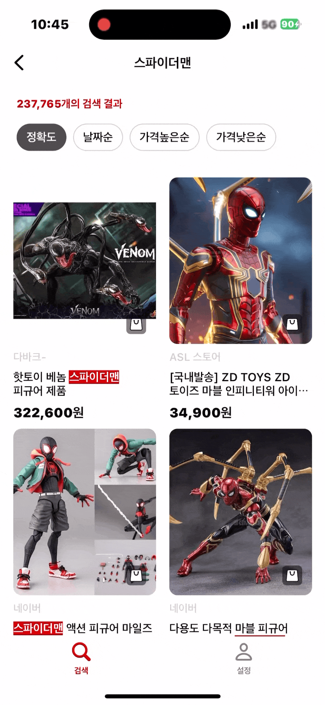

# 🛒 LagomStyle

<br>
<div align=center>
    
    
    
</div>
<br>
<p align="center">
         
</p>

<p align="center"> 
    
     
     
     
</p>
<br>

# 앱 한 줄 소개
> 🛒 소박하게 누릴 만큼만 누리며, 자연과 인간의 공존을 추구하는 소비를 추구해요
<br>

# 주요기능
- 상품 검색
  - 가격/날짜순 기반 상품 검색
- 상품 상세화면
  - 웹 기반 상품 세부 정보 확인
- 장바구니
  - 상품을 장바구니에 추가/삭제
  - 장바구니 폴더 추가/삭제
  - 장바구니별 상품 필터링
<br>

# 주요기술
- 상품 검색
  - Naver 검색 API 활용
  - Offset Based Pagination 적용
- 상품 상세화면
  - WKWebView 활용하여 외부 웹 페이지 연동
- 장바구니
  - RealmSwift를 활용하여 Local DB 저장 및 관리
  - 데이터 필터링 및 저장 구조 설계
<br>

# 프로젝트 환경
- 인원
  - iOS 1명
- 기간
  - 2024.06.13 - 2024.06.18 (약 6일)
- 버전
  -  iOS 15.0 +
<br>

# 프로젝트 기술스택
- 활용기술
  - UIKit, URLSession
  - CodeBasedUI
  - MVVM, Input-Output, Custom Observable
  - Repository Pattern
- 라이브러리

|라이브러리|사용목적|
|-|-|
|RealmSwift|Local DB 구축|
|Snapkit|UI 구성 코드의 가독성 향상|
|SkeletonView|비동기 API 호출 과정에서 로딩 애니메이션 처리|
|Kingfisher|이미지 로드 및 캐싱 처리|
|IQKeyboardManagerSwift|디바이스 Keyboard 사용성 향상|
<br>

# 활용기술

<details>
<summary>폴더와 장바구니 간 양방향 모델링</summary>
<div>

Folder와 Basket 간의 관계는 폴더링을 활용하여 카테고리화된 장바구니의 구조로 설계되었다.

Folder는 여러 장바구니 항목들을 그룹화 할 수 있도록 장바구니 간의
<br>
`1:N to many relationship`의 형태로 구성되어 있으며
<br>
이를 통해 장바구니 항목을 폴더별로 분류할 수 있다.
<p align="center"> 
    
</p>

Basket은 `LinkingObjects`를 통해 해당 장바구니가 속한 Folder와
<br>
`역관계를 형성`하고 있어 역으로 참조가 가능해지기 때문에
<br>
`양방향 참조`가 가능해진다. 이를 통해 특정 Basket 객체가
<br>
어느 폴더에 속해 있는지 쉽게 확인할 수 있다.
<p align="center"> 
    
</p>

</div>
</details>

# 트러블 슈팅

<details>
<summary>딕셔너리의 키 값에 커스텀 타입을 담아준 경우 에러가 발생</summary>
<div>

- 커스텀 타입
```swift
// MARK: 최근 검색어를 저장 및 시간순으로 정렬해주기 위한 데이터 모델
struct NVSSKeyword  { }

private var recentSearchQueries: [NVSSKeyword: Void] { }
// Type 'NVSSKeyword' does not conform to protocol 'Hashable'
```

### 📌 왜 'Hashable' 프로토콜을 채택하지 않았냐고 에러를 뱉는 걸까?

 - 딕셔너리의 키값은 유일성을 가져야한다.
 - 그 이유는 해시 테이블의 개념을 봐야한다.
 - 그렇기에 커스텀 타입은 유일성을 가질 수 없기 때문에 Hashable 프로토콜을 채택하여 hash함수를 통해 해시값을 얻을 수 있게 해줘야 한다.
 - 기본 테이터타입(Int, Double, String...)은 기본적으로 Hashable을 따르고 있어 따로 hash함수를 구현해줄 필요가 없다

</div>
</details>

<details>
<summary>테이블뷰 셀에서 늘어나지 않아야 할 뷰가 늘어난 경우</summary>
<div>

- 갯수를 나타내는 레이블이 오른쪽 이미지와 붙어있어야 하는데 제약조건을 주면서 늘어나버린 상황


- 하이어라키를 확인해보면 늘어나있는 것을 볼 수 있음
 
 
 
- 걸려있는 제약조건
```swift
titleLabel.snp.makeConstraints { make in
    make.bottom.equalTo(contentView.snp.centerY)
    make.leading.equalToSuperview().offset(20)
    make.trailing.equalTo(countLabel.snp.leading).offset(-20)
}

optionLabel.snp.makeConstraints { make in
    make.top.equalTo(contentView.snp.centerY)
    make.leading.equalToSuperview().offset(20)
    make.trailing.equalTo(countLabel.snp.leading).offset(-20)
}

countLabel.snp.makeConstraints { make in
    make.centerY.equalToSuperview()
    make.trailing.equalTo(forwardImageView.snp.leading).offset(-4)
}

forwardImageView.snp.makeConstraints { make in
    make.centerY.equalToSuperview()
    make.trailing.equalToSuperview().offset(-20)
}
```

### 해결 방법
- hugging priority 가 더 높은 뷰는 intrinsicSize 를 유지하려고 하는 특성이 있음
- UILabel hugging priority의 default 값은 251
- countLabel 과 forwardImageView 의 hugging priority 값을 252로 설정

### 결과
- 시뮬레이터


- 하이어라키


- 소스코드
```swift
titleLabel.snp.makeConstraints { make in
    make.bottom.equalTo(contentView.snp.centerY)
    make.leading.equalToSuperview().offset(20)
    make.trailing.equalTo(countLabel.snp.leading).offset(-20)
}

optionLabel.snp.makeConstraints { make in
    make.top.equalTo(contentView.snp.centerY)
    make.leading.equalToSuperview().offset(20)
    make.trailing.equalTo(countLabel.snp.leading).offset(-20)
}

countLabel.setContentHuggingPriority(.init(252), for: .horizontal)
countLabel.snp.makeConstraints { make in
    make.centerY.equalToSuperview()
    make.trailing.equalTo(forwardImageView.snp.leading).offset(-4)
}

forwardImageView.setContentHuggingPriority(.init(252), for: .horizontal)
forwardImageView.snp.makeConstraints { make in
    make.centerY.equalToSuperview()
    make.trailing.equalToSuperview().offset(-20)
}
```

</div>
</details>

<details>
<summary>닉네임 입력 및 변경 시 공백제거에 대한 문제점</summary>
<div>

### 📌 처음에는 textField의 text 변경에 대한 감지가 일어났을 경우, 공백을 제거해주는 메서드를 활용하여 공백을 제거하려했음.
- 해당 메서드 사용 소스코드
```swift
func textFieldDidChangeSelection(_ textField: UITextField) {
    guard let text = textField.text else { return }
    textField.text = text.trimmingCharacters(in: .whitespaces)
}
```

- 잘 돌아가는 것처럼 보였으나 아래의 문제가 발생
- 이유를 확인해보려 공식문서를 확인해보니 `in` 의 조건에 해당하는 문자열을 문자열의 끝에서 제거하여 새 문자열을 반환해주는 메서드였던 것이다.


### 📌 아예 모든 공백을 필터링하여 Text를 교체해주는 방식으로 변경
```swift
func textFieldDidChangeSelection(_ textField: UITextField) {
    guard let text = textField.text else { return }
    textField.text = textField.text?.filter { $0 != " " }
}
```

</div>
</details>

# 회고

> 최근 검색어 처리를 배열에서 딕셔너리로 변경하면서 생긴 장점

- 코드의 양 자체가 줄면서 가독성이 줄어들었다
- 배열일 때
```swift
if !queries.contains(text) { // 최근 검색어에 새로 검색한 키워드가 없다면
    queries.insert(text, at: 0)
    recentSearchQueries = queries
    
    if queries.count > 10 {
        for i in (10..<queries.count).reversed() {
            removeQuery(row: i)
        }
    }
} else {
    for i in 0..<queries.count {
        if queries[i] == text {
            queries.remove(at: i)
            break
        }
    }
    queries.insert(text, at: 0)
    recentSearchQueries = queries
}
```

- 이 위의 코드가 단 1줄로 줄어들었다.
```swift
recentSearchQueries[text] = Date()
```

- 값이 존재할 때라던가 예외처리를 해줄 필요가 없어 코드의 양이 줄었고, 물론 배열에서 딕셔너리로 변경하게 되면서 퍼포먼스적인 향상이 이뤄질 수 밖에 없기도 하다.
    - 배열에서 검색, 추가, 삭제를 하기 위해서는 해당 데이터를 순회하며 찾아야 하며 최악의 경우 전체 인덱스를 다 순회해야하기 때문에 O(N)이 걸린다,
    - 딕셔너리에서 검색, 추가, 삭제의 경우 해시함수를 통해 동작이 이뤄지기 때문에 시간복잡도가 O(1)로 빠르게 작동한다.
<br>

> 뷰와 컨트롤러 형태로 나눠져있던 형태를 뷰모델로 분리하면서 느낀 점

#### ViewModel의 필요성

- 점점 앱의 기능을 추가하게되면서 뷰컨트롤러의 뎁스가 깊어지게 되다보니 이 부분을 해결하고싶다 라는 마음이 강하게 있었지만 기능 구현에 좀 더 집중을 했고, 기능 구현을 목표만큼 한 후에도 역시나 로직 코드를 좀 분리하고싶다 라는 생각이 들었다.
- 물론 ViewModel이라는 선택지가 있다 라는 것은 알고있었지만 UIKit에서의 ViewModel과 내가 SwiftUI로 앱을 개발할 때 구현했던 ViewModel은 구조 자체가 달랐다.(내가 잘못 사용했던건가,,,)
- 어쨌든 ViewController에서 View에 대한 코드를 분리해놨다고 해도 어쨌든 뷰를 구성하는 코드와 네비게이션 푸시 등 아예 분리는 되지 않는다 라는 생각이 들어 ViewModel을 도입하게되었다.

#### Input 액션과 Output 액션으로 작동되는 로직 방식

- 처음에는 로직을 Input과 Output으로 분리를 한다는 것이 이해가 잘 되지 않았다.
- 분리를 왜 해야 하는지에 대한 이해가 아닌 분리하는 과정 자체가 좀 어려우면서 낯설었다.
- 하지만 뷰모델을 분리하면서 점차 어떤식으로 분리를 해야될 지에 대한 생각이 머릿속에서 들게되었다
- 완벽하진 않지만 모든 뷰컨트롤러를 뷰모델로 로직이 분리되면서 어떤 액션에 대한 Input이 들어가고 뷰모델에서 해당 Input을 감지한 후에 Output에 대한 액션을 뷰컨트롤러에 전달하게되면서 기능에 대한 로직 자체가 명확해지다보니 문제가 생겼을 때에 대한 테스트 자체가 확실히 수월해졌다.
- 즉, 로직에 대한 테스트를 수행할 시에 Input과 Output으로 좀 더 잘못된 점을 전보다 빠르게 캐치를 할 수 있게되었고 이러한 것도 어떻게 보면 코드의 가독성이 좋아지도록 리팩토링을 한 것이 아닌가 라는 생각과 동시에 좀 뿌듯하기도 했다.
<br>

> 구현하면서 들었던 의문점 및 마무리

#### 의문점
- 어떤 버튼을 탭했을 때 네비게이션에 푸시를 하는 로직이 있다고 하면 단순히 버튼에 대한 Input 액션을 주고 뷰모델에서 감지하여  뷰컨트롤러에 Output에 대한 액션을 전달해줘 푸시를 해주는 과정 자체가 좀 어색...? 하다라는 생각이 들었지만 현 상황에서는 이게 최선이 아닐까 라는 생각으로 더 공부를 해봐야겠다

#### 마무리
- 아직 완벽한 구조의 MVVM이 아니다.
- MVVM의 구조를 공부하고 분리하기 시작한 것이 아니라서 당연한 것이긴 하지만 좀 더 공부를 해서 MVVM의 구조에 더 적합한 형태의 코드를 작성할 수 있도록 리팩토링을 계속 진행해나갈 것이며 기능적으로 더 해보고싶은 것이 많다.
